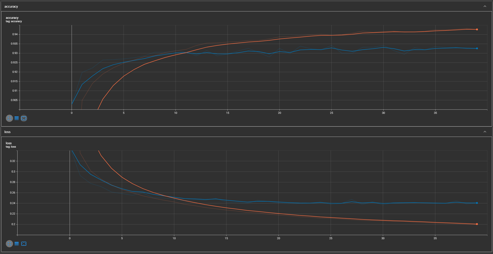
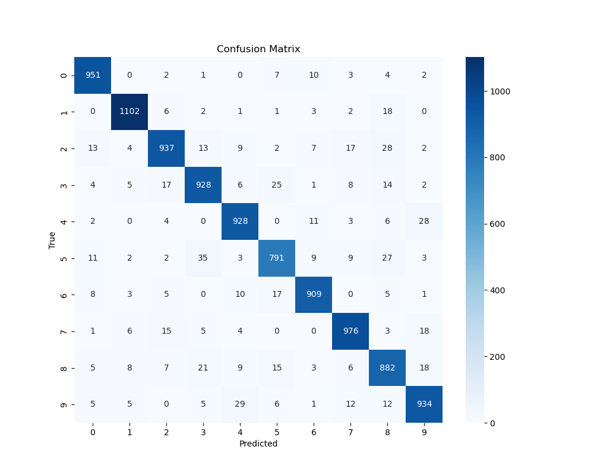

# nist-tflow

## MNIST
- 70,000 grayscale images of handwritten digits (0-9)
- Size 28x28

## Goal
- Test Accuracy > 90%

## Dependencies
- CUDA 11.8
- TensorFlow 2.14.0
- Matplotlib
- Numpy
See conda env file.

## CUDA 11.8 for WSL Ubuntu
```
# Download the CUDA 11.8 repo installer
wget https://developer.download.nvidia.com/compute/cuda/11.8.0/local_installers/cuda-repo-ubuntu2004-11-8-local_11.8.0-520.61.05-1_amd64.deb

# Install the repo
sudo dpkg -i cuda-repo-ubuntu2004-11-8-local_11.8.0-520.61.05-1_amd64.deb
sudo cp /var/cuda-repo-ubuntu2004-11-8-local/cuda-*-keyring.gpg /usr/share/keyrings/

# Update apt
sudo apt-get update

# Install CUDA
sudo apt-get install cuda

# Add CUDA binaries to PATH
echo 'export PATH=/usr/local/cuda-11.8/bin:$PATH' >> ~/.bashrc
echo 'export LD_LIBRARY_PATH=/usr/local/cuda-11.8/lib64:$LD_LIBRARY_PATH' >> ~/.bashrc
source ~/.bashrc
```

# Results
- Simple model is sufficent: 1 dense layer with size 8
- No regularization
- CategoricalCrossEntropy
- Adam as optimizer with default lr



```
Label distribution: 0: 980, 1: 1135, 2: 1032, 3: 1010, 4: 982, 5: 892, 6: 958, 7: 1028, 8: 974, 9: 1009
```

```
313/313 [==============================] - 2s 4ms/step - loss: 0.2646 - accuracy: 0.9268
Test Loss: 0.2646098732948303
Test Accuracy: 0.926800012588501
```